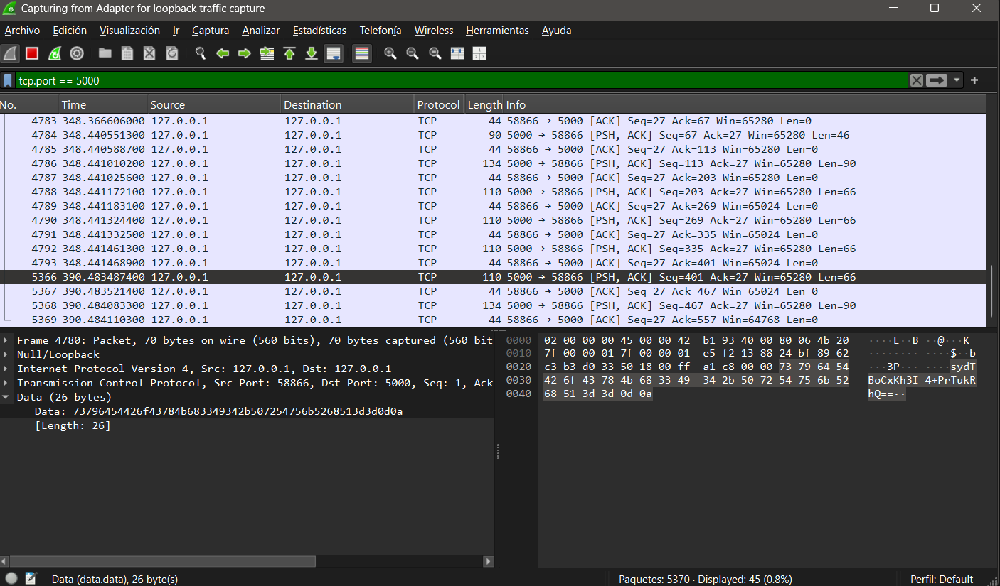

# Ejercicio 4
# Escaneo de tráfico con Wireshark con cifrado AES

### Objetivo
Demostrar que tras aplicar el cifrado AES, los mensajes que circulan por la red ya no son legibles aunque sean interceptados con Wireshark.

### Pasos realizados
Se arrancó la aplicación de debate con el cifrado AES activado.
Se abrió Wireshark con el mismo filtro que en el Apartado 1.
Se conectaron dos clientes y se enviaron mensajes de prueba.
Se capturaron los paquetes y se inspeccionó su contenido.

### Filtro usado en Wireshark
tcp.port == 5000

# Resultado
 En la captura de Wireshark ya no se puede leer el contenido de los mensajes. En lugar del texto original, aparece una cadena de caracteres cifrados en Base64, completamente ilegible. Por ejemplo, el mensaje "Hola, estoy de acuerdo" ahora aparece como algo similar a:
a7Fk2mNpQr8XvLzW9dJcTg==

[Volver al README](../../README.md)