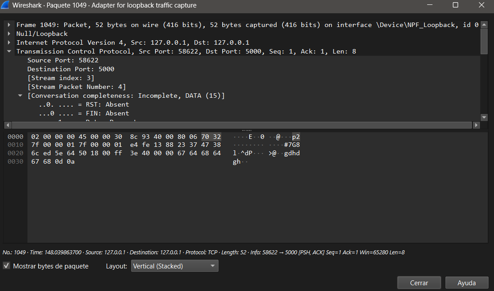

# Ejercicio Uno.
##  Escaneo de tráfico con Wireshark SIN CIFRADO
### Objetivo
Demostrar que sin cifrado, cualquier persona que esté escuchando la red puede leer los mensajes del debate sin ningún problema.
### Pasos realizados

-Se arrancó la aplicación de debate de la Práctica 1 (sin cifrado).
-Se abrió Wireshark y se seleccionó la interfaz de red Loopback (lo) para capturar el tráfico local.
-Se aplicó el filtro tcp.port == 5000 para ver solo el tráfico de nuestra aplicación.
-Se conectaron dos clientes y se enviaron mensajes de prueba.
-Se capturaron los paquetes y se inspeccionó su contenido.

### Filtro usado en Wireshark
tcp.port == 5000

###  Resultado
En la captura de Wireshark se puede ver claramente el contenido de los mensajes en texto plano.

[Volver al README](../../README.md)